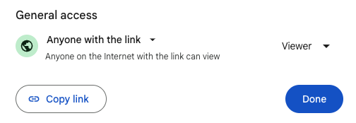
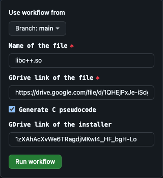

# ida-actions
GitHub Actions to analyse file using IDA

## Steps to run:

1. Upload the file to Google Drive

2. Set the file access to anyone with link

3. Create new workflow in the Github Action of this repo

4. Fill the file name and paste the link of the file in the input fields

5. Run workflow and wait for the results

## Technlogy Communication
> Email: patel.kuldip91@gmail.com